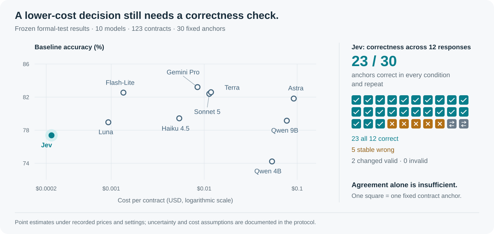

<div align="center">

# Jev Benchmark

## [Visit the project website ↗](https://zf-utokyo.github.io/Jev-Benchmark/)

**Explore the interactive results, evaluation overview, and model comparisons.**

### Cost, accuracy, and consistent correctness in contract inference

**10 models · 123 test contracts · 30 fixed anchors · 4,830 recorded attempts**

[**Project website**](https://zf-utokyo.github.io/Jev-Benchmark/) &nbsp; · &nbsp;
[**Results**](#results-at-a-glance) &nbsp; · &nbsp;
[**Protocol**](docs/protocol.md) &nbsp; · &nbsp;
[**Reproduce**](#reproduce-the-recorded-results) &nbsp; · &nbsp;
[**Manuscript source**](https://github.com/ZF-Utokyo/Jev/blob/main/main.tex)

</div>

[](https://zf-utokyo.github.io/Jev-Benchmark/)

Evaluation code and sanitized prediction records for **Jev and nine language
models** on the classification component of ContractNLI. This release supports
offline recomputation of the core formal-test accuracy, correctness, cost, and
response-time results.

The accompanying manuscript is *Cost–Accuracy Trade-offs in Contract Inference:
Evaluating Jev and Language Models*. Its source is maintained in a
separate manuscript repository; this is not a published-paper link.

## Results at a glance

**Jev occupies the lowest-cost end of the observed comparison**, with 77.38%
baseline accuracy and a 1.24-second median response time. Gemini Pro has the
highest baseline accuracy (83.21%). Sonnet has the largest observed count of
anchors correct in all twelve responses (24/30), compared with Jev's 23/30;
the paired interval for this difference includes zero.

| Recorded configuration | Baseline accuracy ↑ | Cost / contract (USD) ↓ | Median response time ↓ | All 12 correct ↑ |
| :--- | ---: | ---: | ---: | ---: |
| **Jev 1.13.0** | 77.38% | **$0.000228** | **1.24 s** | <ins>23/30</ins> |
| Gemini 3.5 Flash-Lite | 82.54% | $0.001353 | <ins>1.60 s</ins> | 21/30 |
| Gemini 3.1 Pro Preview | **83.21%** | $0.008474 | 3.73 s | 22/30 |
| GPT-5.6 Luna | 78.96% | <ins>$0.000931</ins> | 1.74 s | 22/30 |
| GPT-5.6 Terra | <ins>82.59%</ins> | $0.011839 | 11.61 s | 20/30 |
| GPT-6 Astra | 81.83% | $0.091890 | 20.94 s | 22/30 |
| Claude Haiku 4.5 | 79.44% | $0.005396 | 5.65 s | 19/30 |
| Claude Sonnet 5 | 82.40% | $0.011352 | 3.27 s | **24/30** |
| Qwen3.5-4B | 74.22% | $0.053653 | 86.87 s | 17/30 |
| Qwen3.5-9B | 79.15% | $0.077361 | 134.64 s | 18/30 |

*Point estimates from [the frozen metrics](data/expected_metrics.json), grouped
by model family. Bold marks the best value; underline marks the second best. Costs use recorded prices and billing assumptions, including
GPU rental equivalents. Response times include network and service overhead.
The [protocol](docs/protocol.md) defines uncertainty and comparison limits.*

Agreement alone does not establish correctness: Jev's 28 unchanged anchors
include **five consistently wrong answers**. “All 12 correct” requires the gold
label in every request condition and repeat. Baseline accuracy and anchor
correctness use different target sets, so differences in their rankings do not
by themselves isolate sensitivity to request conditions.

## Reproduce the recorded results

Use **Python 3.10 or later**. From the repository root:

```sh
python -m venv .venv
source .venv/bin/activate
python -m pip install -e .
python -m analysis.reproduce --check
python -m analysis.figures
python -m unittest discover -s tests
```

After dependencies are installed, analysis and plotting run **offline, with no
model calls**. The analysis reads `data/predictions.jsonl`, checks the frozen
reference in `data/expected_metrics.json`, and writes `results/metrics.json`,
`results/baseline.csv`, and `results/anchor.csv`. The `--check` command also
independently recomputes request costs from sanitized usage, elapsed time, and
recorded price snapshots.

Plotting writes PDF, SVG, and PNG figures plus captions to `results/figures/`:

- **`cost_accuracy`** — baseline cost versus accuracy; descriptive 95% intervals
  remain in the metric data.
- **`correctness_response_time`** — all-twelve-correct anchor counts and median
  baseline response times.

These are portable views of the core results. This release does not claim to
recreate every appendix table, development diagnostic, or the paper's exact
figure layout. See [release scope](docs/release_scope.md) for coverage.

## Evaluation scope

| Panel | Design | Requests per model |
| :--- | :--- | ---: |
| Official test baseline | 123 contracts × 17 judgments, jointly requested | 123 |
| Controlled test anchors | 30 contracts × 1 fixed anchor × 4 conditions × 3 repeats | 360 |

The baseline contains **2,091 intended judgments per model**. Controlled
conditions vary visible hypotheses, requested outputs, and requested output
order while preserving the target and contract. Evidence-span extraction is
outside this evaluation.

All **4,830 attempts and 13 invalid requests** remain in the released records.
Invalid requests count as incorrect and remain in cost and response-time
summaries. Requests are not repaired or replaced.

Costs combine reported API charges, token-price estimates, and local GPU
rental-equivalent estimates at **$2.00 per GPU-hour**. Response time is measured
client elapsed time, including network and service overhead. These measures do
not isolate model computation. Model settings and provider interfaces differ;
Sonnet, Terra, and Haiku were added after inspection of earlier results. See the
[full protocol](docs/protocol.md) for inference settings, uncertainty, and limits.

## Run a new evaluation

[Rerunning instructions](docs/rerunning.md) cover dataset preparation, adapters,
explicit inference settings, and endpoint configuration. The runner first
produces an offline request plan; sending requests requires `--execute`. Keep
new outputs separate from the frozen records.

```sh
python -m benchmark.data --output-dir data
python -m benchmark.run --panel test123 --data-dir data \
  --adapter openai --model YOUR_MODEL_ID --model-key new-model \
  --output-dir runs/new-model
```

Preparing data downloads the upstream archive unless an existing archive is
provided. A new evaluation requires an available model endpoint and can incur
charges. The package configures neither model hosting nor credentials.
Recomputing recorded results is deterministic; new hosted-model responses may
differ because models, providers, and serving configurations can change.

## Repository guide

| Path | Purpose |
| :--- | :--- |
| [`data/`](data/) | Sanitized frozen records and reference metrics |
| [`analysis/`](analysis/) | Offline scoring, verification, and plotting |
| [`benchmark/`](benchmark/) | Dataset preparation and explicit new-run utilities |
| [`configs/`](configs/) | Recorded model settings and evaluation price snapshots |
| [`docs/`](docs/) | Protocol, release scope, rerunning, and website maintenance |
| `results/` | Generated analysis and figures; not tracked |

[Release scope](docs/release_scope.md) describes retained fields and reproduction
limits. [`RELEASE_MANIFEST.json`](RELEASE_MANIFEST.json) lists released-file
SHA-256 hashes. The project website is maintained separately on `gh-pages`; see
[website maintenance](docs/project_website.md) for publication and access details.

Contract text and annotations originate from the
[ContractNLI dataset](https://stanfordnlp.github.io/contract-nli/).
The upstream dataset's terms apply to its contents. This repository does not
grant additional rights to third-party data or models.
