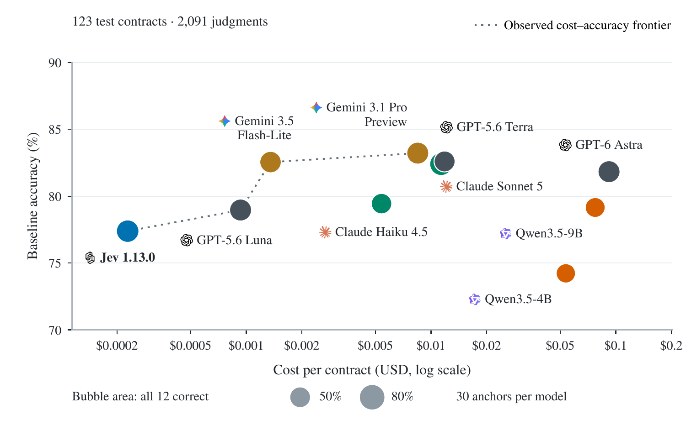

# Same score. Different decisions.

### Cost, accuracy, and consistent correctness in contract inference

## [Visit the project website ↗](https://zf-utokyo.github.io/Jev-Benchmark/)

**Explore the interactive results, evaluation overview, and model comparisons.**

**10 models · 123 test contracts · 30 fixed anchors · 4,830 recorded attempts**

